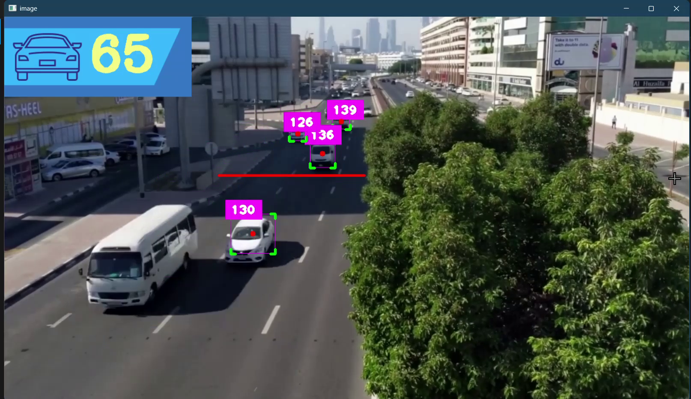

# 🚗 Car Counter using YOLOv8

A real-time car counting system powered by YOLOv8 and OpenCV. This project detects and counts vehicles in traffic surveillance videos, making it a practical solution for smart city applications such as traffic monitoring, vehicle analytics, and transport optimization.

---

## 🎬 Demo

[](Assets/Demo-CarCounterYOLO.mp4)

---

## 📌 Features

-  **YOLOv8-based object detection** (cars, buses, trucks, motorbikes)
-  **Accurate tracking** using the SORT (Simple Online and Realtime Tracking) algorithm
-  **Region of Interest (ROI)** masking to filter detections
-  **Vehicle counting** logic based on line-crossing
-  **Overlay graphics** using transparent PNGs
-  Compatible with **videos and webcams**
-  Easy to **configure, extend, and deploy**

---

## 🚀 Technologies Used

- [Python 3.x](https://www.python.org/)
- [YOLOv8](https://github.com/ultralytics/ultralytics)
- [OpenCV](https://opencv.org/)
- [Ultralytics](https://pypi.org/project/ultralytics/)
  
---

## 🚀 Getting Started

### 1️⃣ Clone the repository

```
git clone https://github.com/Sravan2804/Car-Counter-YOLO.git
cd Car-Counter-YOLO
```

### 2️⃣ Set up a virtual environment (recommended)

```
python -m venv venv
venv\Scripts\activate
```

### 3️⃣ Install dependencies

```
pip install -r requirements.txt
```

## ▶️ Running the Application
Run with a video file:
```
python main.py
```
By default, the code uses:
```
cap = cv.VideoCapture("Assets/cars.mp4")
```
To use a webcam instead:
```
cap = cv.VideoCapture(0)
```

## 🧠 Tech Stack
| Tool/Library | Purpose                             |
| ------------ | ----------------------------------- |
| YOLOv8       | Real-time object detection          |
| OpenCV       | Frame handling, drawing, processing |
| cvzone       | Simplified UI overlays on OpenCV    |
| SORT         | Object tracking (ID assignment)     |
| NumPy        | Array math and matrix ops           |
| Python 3.9+  | Programming language                |

## 🧠 How It Works

- Load YOLOv8 model
- Process each frame of the input video
- Detect cars and count them based on crossing a predefined line
- Display the count live on video output


## Real-world Relevance

- Smart traffic monitoring
- Traffic flow analytics
- Toll booth vehicle counting
- Parking management systems
- CCTV-based traffic insights
- Smart city dashboards


## 🧰 Future Improvements
- Direction-aware IN/OUT counting
- Log results to CSV/Excel
- Streamlit or Gradio Web UI
- Track unique cars using Deep SORT
- Multi-lane, multi-zone tracking


